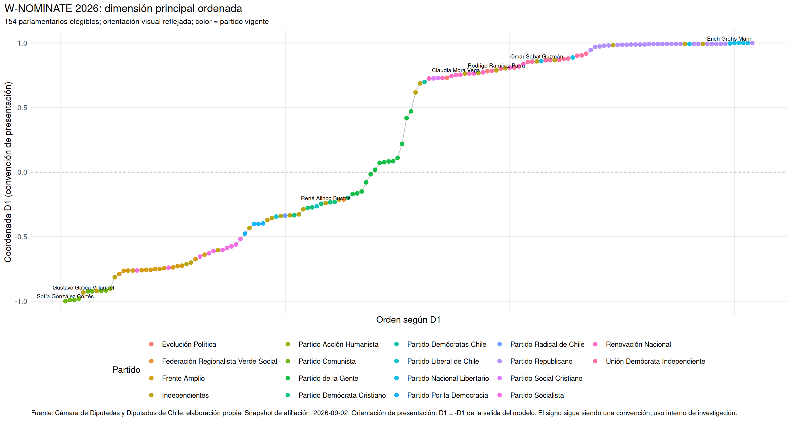
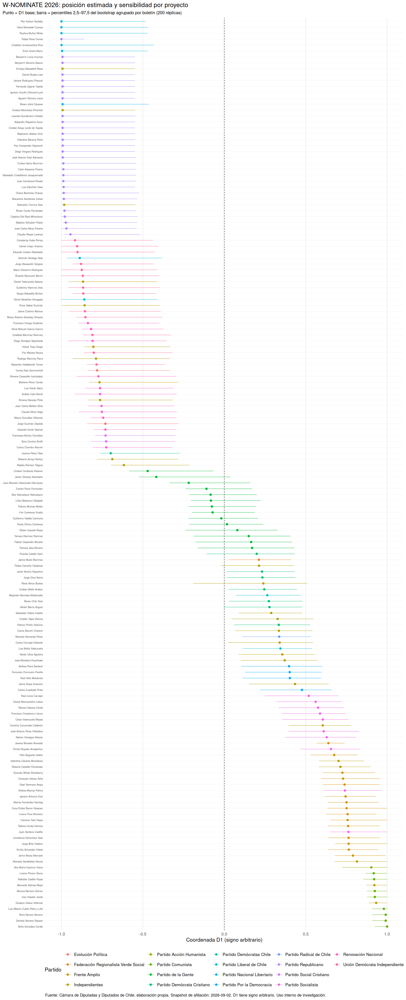
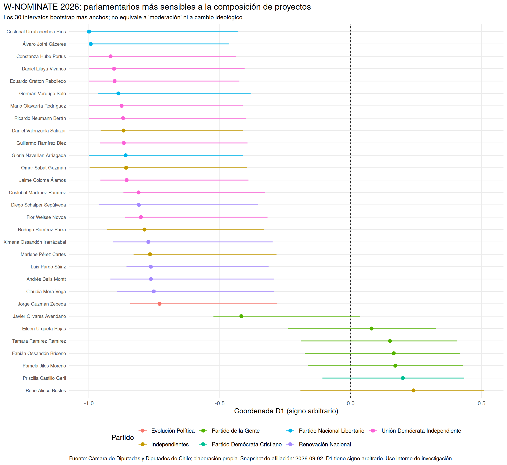
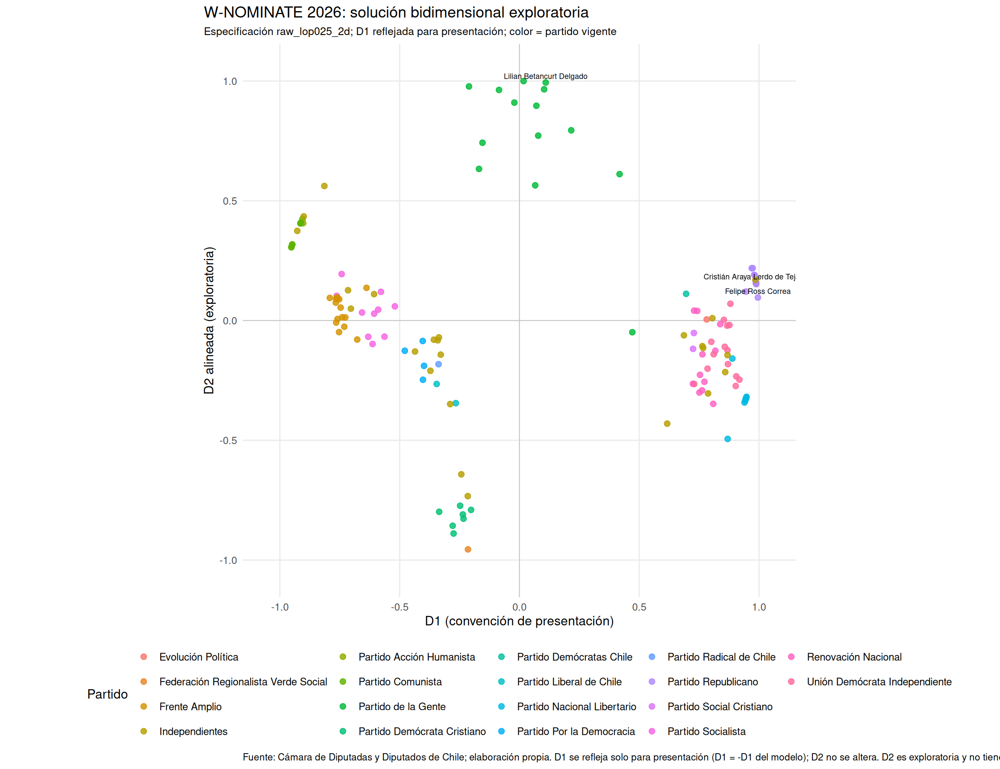
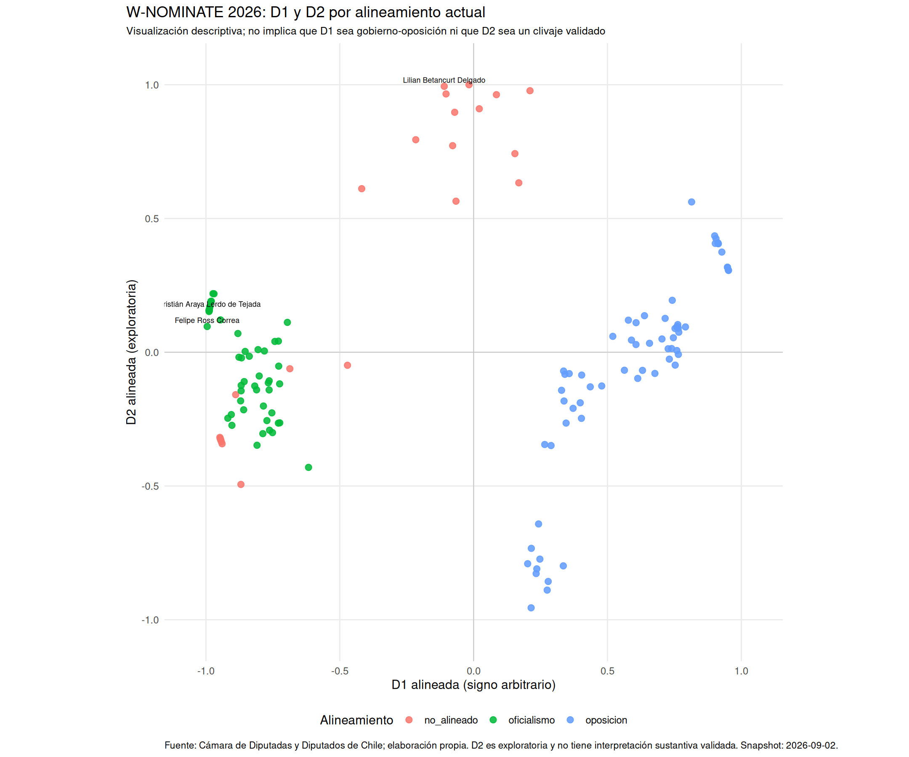

# Galería de figuras W-NOMINATE — investigación 2026

> **Uso interno de investigación.** D1 mantiene signo arbitrario y no se interpreta todavía como izquierda/derecha, oficialismo/oposición o ideología. D2 sigue siendo exploratoria. Ninguna de estas figuras está marcada como lista para publicación pública.

Esta página reúne las visualizaciones generadas automáticamente por `scripts/plot_wnominate_research.R` a partir de la corrida de investigación W-NOMINATE 2026.

## 1. D1 ordenada por partido

Versión ordenada de los parlamentarios sobre D1. El color representa partido vigente en el snapshot de afiliaciones usado para la corrida.

## 2. D1 con incertidumbre — Cámara completa

Punto base W-NOMINATE más intervalo de sensibilidad obtenido mediante bootstrap agrupado por proyecto/boletín.

## 3. D1 con incertidumbre — 30 casos más sensibles

Detalle de los 30 parlamentarios con intervalos más amplios en el bootstrap por proyecto. Sirve para ver dónde la ubicación individual depende más de la composición de la agenda legislativa.

## 4. D1 × D2 por partido — exploratorio

Solución bidimensional exploratoria. D2 no se eleva todavía a dimensión sustantiva ni recibe etiqueta temática.

## 5. D1 × D2 por alineamiento — exploratorio

La misma geometría 2D, coloreada por alineamiento vigente. El color es descriptivo y no define el significado matemático de los ejes.

---

### Archivos vectoriales

Cada figura también se guarda en PDF en `data/legislative/2026/wnominate/figures/` para uso en papers, presentaciones o revisión de alta resolución.
